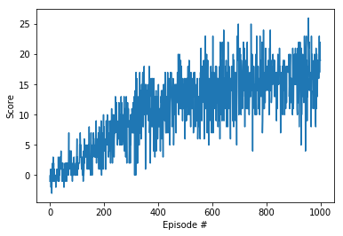

# Report

## Learning algorithm

The implemented learning algorithm is based on the Deep Q Learning approach originally described in Google´s DeepMind [Nature publication : "Human-level control through deep reinforcement learning (2015)"](https://storage.googleapis.com/deepmind-media/dqn/DQNNaturePaper.pdf). As an input, the vector of state with size 37 is obtained by the sensors of the agent is employed.

There are two main improvements with respect to traditional Deep Q Learning algorithms as part of the solution. In first place, experience replay is used by means of a replay buffer to break correlations between consecutive sample sequences. This is carried out by sampling randomly from the replay buffer that contains samples history. Secondly, the so called Fixed Q-Targets concept is employed. In this case, this strategy aims to prevent correlations with the targe by updating network weights periodically. This helps the algorithm to have enough time to learn from the otherwise fastly changing network. The steps of the complete algorithm can be found in the picture below:


This algorithm screenshot is taken from the [Deep Reinforcement Learning Nanodegree course](https://www.udacity.com/course/deep-reinforcement-learning-nanodegree--nd893)

It is important to recall that the vector of state only has 37 dimensions. Therefore, it is enough to build a Neural Network with just fully connected layers followed by Rectified Linear Units (ReLUs). If images are to be used as the state-space, then a Convolutional Neural Network (CNN) needs to be designed. The deep neural network is composed by the following layers and stages:

- Fully connected layer - input: 37 (state size) | output: 64
- ReLU layer - activation function
- Fully connected layer - input: 64 |  output 64
- ReLU layer - activation function
- Fully connected layer - input: 64 | output: (action size)

Hyperparameters tuned and used in DQN algorithm:

- Number of training episodes: 1000
- Maximum steps per episode: 1000
- Starting epsilon, where epsilon is used for epsilon-greedy policy: 1.0
- Ending epsilon: 0.01
- Epsilon decay rate: 0.999
- Number of hidden layers and units per layer of neural network: [64, 64]
- Replay buffer size: 10000
- Batch size: 64
- Gamma (discount factor): 0.99
- Adam optimizer learning rate: 0.0005

## Results

### Training



```
Episode 100	Average Score: 0.84
Episode 200	Average Score: 3.73
Episode 300	Average Score: 7.14
Episode 400	Average Score: 10.35
Episode 500	Average Score: 12.18
Episode 540	Average Score: 13.02

Environment solved in 440 episodes!	Average Score: 13.02

Episode 545	Average Score: 13.03
Episode 546	Average Score: 13.02
Episode 559	Average Score: 13.11
Episode 560	Average Score: 13.08
...
Episode 600	Average Score: 13.23
...
Episode 700	Average Score: 14.78
...
Episode 800	Average Score: 15.28
...
Episode 900	Average Score: 15.94
...
Episode 1000	Average Score: 16.25

Environment training finished after 1000 episodes!	Average Score: 16.25
```

### Untrained vs trained agent


## Future lines


1. Explore Double Deep Q Networks to avoid overestimation of Q-values in the early learning stages 
3. Implement Prioritized Experience Replay by giving priority weights or probabilities (based on the TD error) to the samples stored in    the replay buffer. This helps to increase the selection frequency of relevant experiences or samples.
4. Use Dueling Deep Q Networks to mantain two Deep Q networks. While one network estimates state values, the other predicts the state-      dependent action advantage function. The combination of both has been proven to improve vanilla algorithm significantly.
5. Investigate on Google´s DeepMind RAINBOW Paper and try to replicate results.
6. Learning from pixels. Although a CNN has been designed in order to adapt to the new state-space, GPU performance capacity would be      required to accomplish training.
