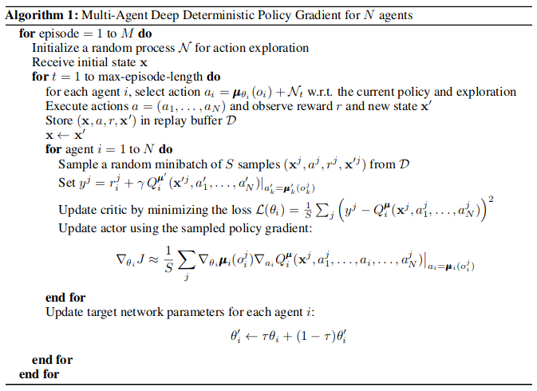
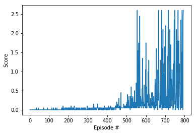

# Report

## Learning algorithm

The implemented learning algorithm is based on the Actor-Critic method called Deep Deterministic Policy Gradient (DDPG) approach, which is originally described in Google´s DeepMind paper ["Continuous Control with Deep Reinforcement Learning (2016)"](https://arxiv.org/pdf/1509.02971.pdf) and is adapted for a multi agent collaboration scenario following OpenAI´s paper ["Multi-Agent Actor-Critic for Mixed Cooperative-Competitive Environments"](https://arxiv.org/abs/1706.02275). The input to the algorithm is a vector of state with size 24 obtained by the sensors of each agent. In total, two agents have been simultaneously trained in parallel to collaborate and help each other in the learning process, although it has been proved that the implementation works fine by training the agents without sharing any information as well. The steps of the complete algorithm can be found in the picture below:



This algorithm screenshot is taken from the [OpenAI´s paper](https://arxiv.org/pdf/1706.02275.pdf)


As described in the literature, a shared replay buffer has been created where agents can save and sample experiences. Moreover, several modifications have been applied to the original algorithm in order to adapt the method to the actual problem. In first place, some of the hyperparameters of the Deep Neural Network of the actor and the critic have been modified. For example, batch normalization has been used between fully connected layers in order to speed up the training. What is more, each actor only uses its own information to predict actions, whereas each critic also knows the other agent´s (states, actions) pairs for predicting Q values. Apart from the replay buffer, that is how information is shared to promote collaboration. Other than that, a similar structure has been defined for the actor and critic DNNs:

### Actors DNN Architecture
- Fully connected layer - input: 24 (state size) | output: 128
- ReLU layer - activation function
- Batch normalization
- Fully connected layer - input: 128 |  output 128
- ReLU layer - activation function
- Fully connected layer - input: 128 | output: (action size)
- Output activation layer - tanh function

### Critics DNN Architecture
- Fully connected layer - input: 24 (state size) * 2 (number of agents) = 48 | output: 128 * 2 (number of agents) = 256
- ReLU layer - activation function
- Batch normalization
- Fully connected layer - input: (256 + 2 (action size)) * 2 (num_agents) =  516 |  output: 128
- ReLU layer - activation function
- Fully connected layer - input: 128 | output: 1
- Output activation layer - tanh function

At initialization, random weights of the source network have been copied to the target network. Furthermore, the learning rate for both optimizers has been set to be the same, namely 2e-4. Gradient in the critic network has also been clipped to control regularization and avoid overtraining. Apart from that, making the agent explore only at the beginning of the training (until an average reward over last 100 episodes greater than 0.025 is achieved) by adding Ornstein-Uhlenbeck noise resulted in a faster convergence. Finally, the algorithm has been adapted to support simultaneous training of 2 agents by adding 1 experience per agent to the replay buffer every time step and updating the network sampling 4 experiences from the buffer every time step. As a result of this enhancements, convergence has been considerably shortened.

Other hyperparameters tuned and used in the DDPG algorithm:

- Number of training episodes: 5000
- Maximum steps per episode: until episode ends
- Replay buffer size: 100000
- Batch size: 128
- Gamma (discount factor): 0.99
- Adam optimizer learning rate for actor and critic: 2e-4
- Tau: 1e-3
- Weight decay: 0
- Noise decay: 1.0 (it becomes 0.0 if average reward over last 100 episodes is greater than 0.025)

## Training and Results

Looking at the training process, it can be clearly seen that it takes about 250 episodes to stop using a random policy and really start learning. This is because it takes some time to the agents to start hitting the ball and gathering meaningful experiences. After that, noise is not added anymore and the agent greedily and quickly learns to get and average score of more than 0.75 in less than 800 episodes. The whole process takes roughly 2 hours, which is considered to be short given that no GPU has been used during training.



```
2018-12-11 12:21:59: start!

Episode 1	Average Score: -0.0050
Episode 100	Average Score: -0.0030
Episode 200	Average Score: 0.00305
Episode 300	Average Score: 0.0130
Episode 400	Average Score: 0.0234
Episode 500	Average Score: 0.0570
Episode 600	Average Score: 0.2900
Episode 700	Average Score: 0.4101
Episode 724	Average Score: 0.5006
Environment solved in 724 episodes!	Average Score: 0.50
Episode 793	Average Score: 0.7612
Average score of 0.75 or more achieved in 793 episodes!	Average Score: 0.76

 2018-12-11 14:24:04: end!
```

## Future lines

1. Further fine tuning of hyperparameters for faster training
2. Design a prioritized replay buffer in order to sample most relevant experiences
2. Implement the D4PG algorithm for collaborative multiple agents from the other [Google DeepMind´s paper](https://openreview.net/pdf?id=SyZipzbCb).
3. Try to get similar performance results with TRPO (Trust Region Policy Optimization), PPO (Proximal Policy Optimization) and REINFORCE, adapted for multiple agents collaboration.
